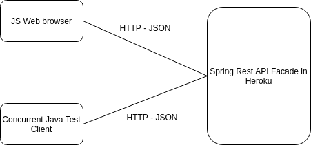
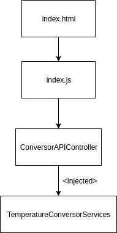

# Parcial 3, Sebastián Camilo Reyes Villamil.
## Links
- Heroku: https://arsw-parcial3.herokuapp.com
## Arquitectura
La aplicación se compone de una pagina web y de un servicio API-REST desplegado en Heroku que le permite convertir la temperatura de grados Celsius a Fahrenheit y vice versa.

La aplicacion usa axios para conectarse al API-REST al cual se le inyecta el servicio que hace la conversión de la temperatura.

